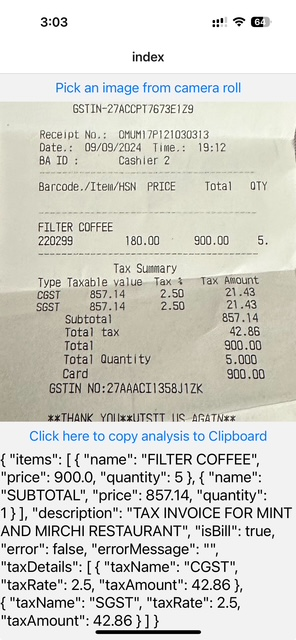

# Welcome to Bill Analyzer App 👋

This is an expo app that runs ocr with the help of Google Gemini

## Get started

1. Clone the repo
2. Run yarn

   ```bash
   yarn
   ```

2. Start the app

   ```bash
    npx expo start
   ```

In the output, you'll find options to open the app in a

- [development build](https://docs.expo.dev/develop/development-builds/introduction/)
- [Android emulator](https://docs.expo.dev/workflow/android-studio-emulator/)
- [iOS simulator](https://docs.expo.dev/workflow/ios-simulator/)
- [Expo Go](https://expo.dev/go), a limited sandbox for trying out app development with Expo

You can start developing by editing the files inside the **app** directory. This project uses [file-based routing](https://docs.expo.dev/router/introduction).

3. Get gemini api key from [Google AI Studio](https://aistudio.google.com/app/apikey).
4. Create .env file
   
   ```bash
    cp .env.example .env
   ```
5. Replace the Api key with the key generated in step 3.

### Screenshot

